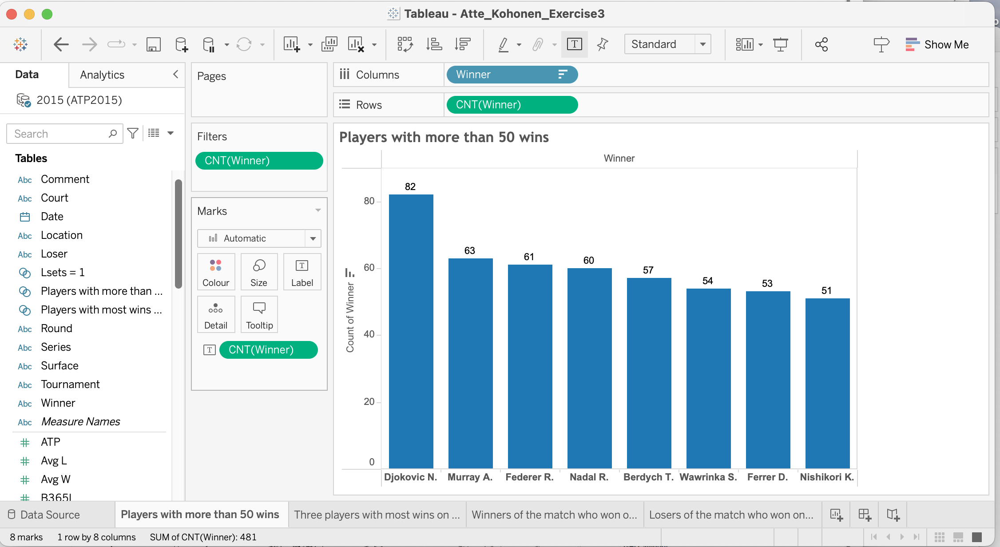
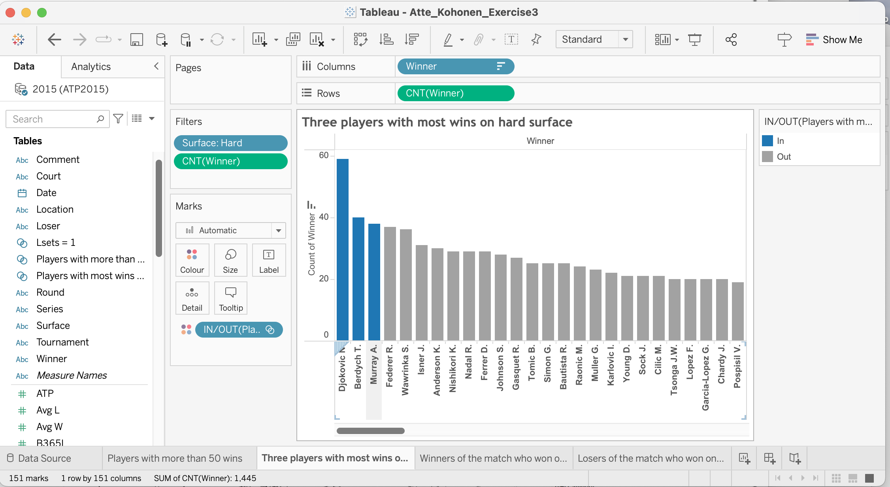
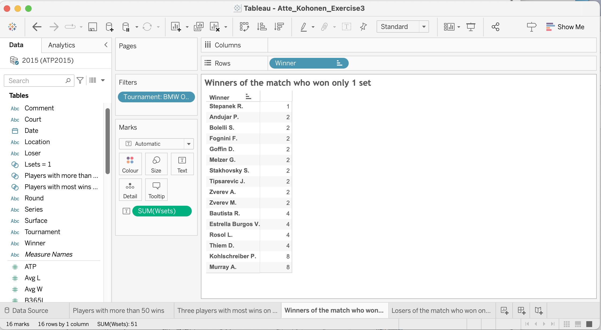
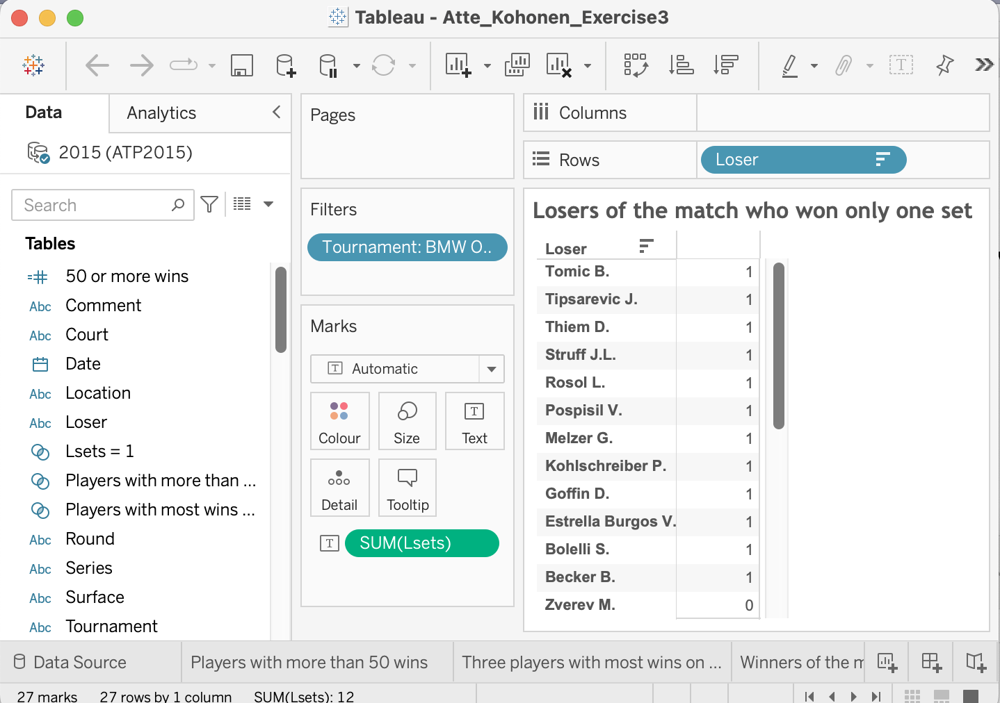

# Tableau-Assingment
## Task1.
#### Review the dashboard in Fig. 1. List and briefly discuss at least 3 weaknesses of this visualization based on what you have learned in the Visual Data Storytelling videos. For each weakness, provide a suggestion for improvement.

### Answer to Task 1. Visual design
The “total sales” pie chart gives an idea of how much the total sales for each category is, but it doesn’t provide any numbers that would make it even more informative. Therefore, it should have numbers in currency or percentages to make it clear how much the items in each category have sold. Also, a pie chart can be useful when illustrating a maximum of two different categories, but if it is more than that it would be better to use different plots, such as the Treemap plot. In addition, it is hard to see how much each of the slices of the pie chart represents of the total amount because of the angles of the slices.
The “My analysis” bubble chart is a bit unclear in the sense that the decimals don’t indicate any format. Does it try to conceptualize the average discount in percentages or in some currency? Also, it should have percentages or integers instead of decimals to make it clearer. Furthermore, the regions should be modified. Now it is a mix of individual countries, such as Canada and larger regions such as EMEA which consists of multiple countries. There are also regions that leaves one guessing, such as the “ South” and “West” regions. It is hard to say which southern and western regions the chart tries to highlight. Therefore, the regions should be clearly indicated, for example by larger regions such as EMEA, Asia, North America etc.
The ”profit by country” should use other color combinations such as blue–green instead of red-green because many people might have color deficiency. Also, one might consider using a different chart type to represent the profit by country, since maps can sometimes get confusing. For instance, using a simple bar plot might be more simple option to represent quantities.

## Task2. Basic charts in Tableau
#### Use the ATP Tennis workbook to answer these questions. In this case, create a visualization (it can also be a simple table) that answers the question, with a separate sheet for each question. Additionally, describe the answer and how the visualization answers it in the main assignment file.

#### • How many players had more than 50 wins in this dataset?
### Answer

- Answer: 8
- For this answer, I used a bar chart to visualize the number of matches won by each
winner
#### • Which three players had the most wins on hard courts in this dataset? (’hard’ is a category in Surface)
### Answer

- Djokovic N., Berdych T. and Murray A.
- Similarly to the previous question, I used a bar chart. This time, however, I created a set of the players with the most wins on the hard surface to highlight them in the dataset.
  
#### • How many players in this dataset won only one set in the BMW Open? (Lsets records the number of sets the Loser of the match won, and Wsets records the number of sets the Winner of a match won; in this tournament, you have to win two sets to win a match)
### Answer

- 13 players
- I created separate lists of the winners of the match who won only one set and losers
of the match who won only one set. Even though two sets are needed to win the match, there is only one player marked as a winner of the match who won only one set. In comparison, 12 losing players of the match won only one set. In both, cases I used the BMW open tournament as a filter.

 

## Task3. 
#### In this task, you need to perform data analysis tasks for a super- market chain (’supermarket.csv’). You have the following information in the dataset:
#### • Branch: branch of the supermarket chain, there is data about three different branches (A, B, and C) • Customer type: indicating whether the customer is a Member of the loyalty program or not
#### • Gender: the gender of the customer
#### • Quantity: number of products purchased by the customer
#### • Total: amount of purchase
#### • Payment: payment type used by the customer
#### • Income: income of the customer
#### • Rating: rating given by the customer to the store
#### In this task you need to understand the relationship between Rating and the other columns. Specifically, you need to provide some insights on differences in Rating in terms of the variables available, e.g., Rating differences across branches, customer types, gender, income of the customer, or payment type. You need to create at least 4 charts, and each column of the data should appear in at least one chart. Finally, combine the charts into a dashboard that you would present to managers of the supermarket chain, and write a 1-2 page report on the insights you gained and what actions you recommend the company to do in order to address issues that you found to be related to low ratings.

