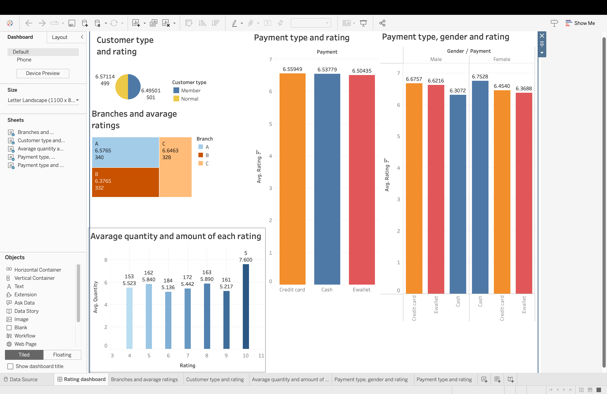
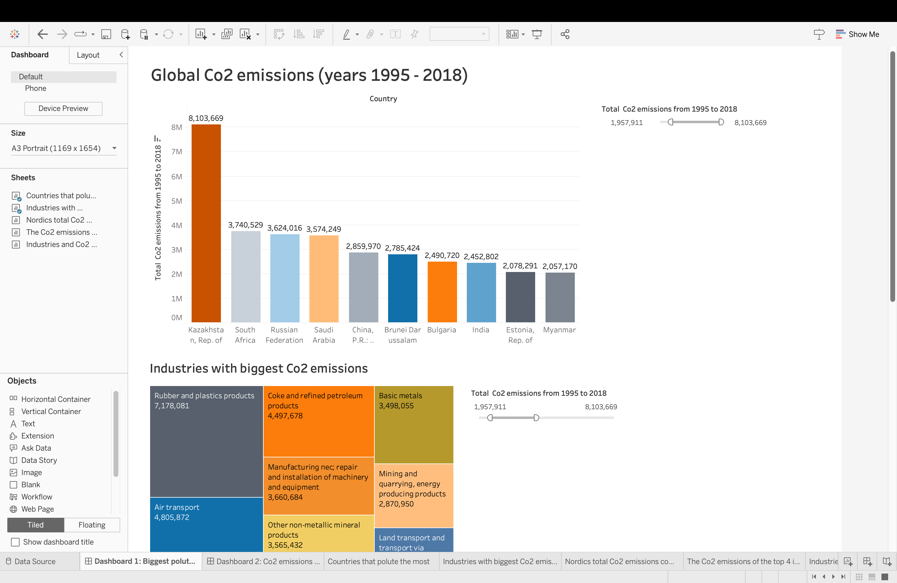
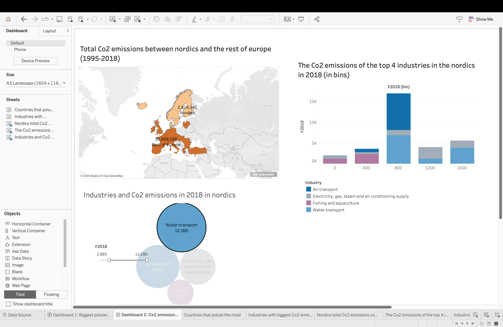

# Tableau-Assignment
# Brief
This is a final assignment that I did during a business intelligence course while studying at the university. In this assignment, I interpreted dashboards and  used Tableau to visualize and analyze various datasets.  

## Task1.
#### Review the dashboard in Fig. 1. List and briefly discuss at least 3 weaknesses of this visualization based on what you have learned in the Visual Data Storytelling videos. For each weakness, provide a suggestion for improvement.

### Answer 
The “total sales” pie chart gives an idea of how much the total sales for each category is, but it doesn’t provide any numbers that would make it even more informative. Therefore, it should have numbers in currency or percentages to make it clear how much the items in each category have sold. Also, a pie chart can be useful when illustrating a maximum of two different categories, but if it is more than that it would be better to use different plots, such as the Treemap plot. In addition, it is hard to see how much each of the slices of the pie chart represents of the total amount because of the angles of the slices.
The “My analysis” bubble chart is a bit unclear in the sense that the decimals don’t indicate any format. Does it try to conceptualize the average discount in percentages or in some currency? Also, it should have percentages or integers instead of decimals to make it clearer. Furthermore, the regions should be modified. Now it is a mix of individual countries, such as Canada and larger regions such as EMEA which consists of multiple countries. There are also regions that leaves one guessing, such as the “ South” and “West” regions. It is hard to say which southern and western regions the chart tries to highlight. Therefore, the regions should be clearly indicated, for example by larger regions such as EMEA, Asia, North America etc.
The ”profit by country” should use other color combinations such as blue–green instead of red-green because many people might have color deficiency. Also, one might consider using a different chart type to represent the profit by country, since maps can sometimes get confusing. For instance, using a simple bar plot might be more simple option to represent quantities.

## Task2. Basic charts in Tableau
#### Use the ATP Tennis workbook to answer these questions. In this case, create a visualization (it can also be a simple table) that answers the question, with a separate sheet for each question. Additionally, describe the answer and how the visualization answers it in the main assignment file.

#### • How many players had more than 50 wins in this dataset?
### Answer

- Answer: 8
- For this answer, I used a bar chart to visualize the number of matches won by each
winner
#### • Which three players had the most wins on hard courts in this dataset? (’hard’ is a category in Surface)
### Answer

- Djokovic N., Berdych T. and Murray A.
- Similarly to the previous question, I used a bar chart. This time, however, I created a set of the players with the most wins on the hard surface to highlight them in the dataset.
  
#### • How many players in this dataset won only one set in the BMW Open? (Lsets records the number of sets the Loser of the match won, and Wsets records the number of sets the Winner of a match won; in this tournament, you have to win two sets to win a match)
### Answer

- 13 players
- I created separate lists of the winners of the match who won only one set and losers
of the match who won only one set. Even though two sets are needed to win the match, there is only one player marked as a winner of the match who won only one set. In comparison, 12 losing players of the match won only one set. In both, cases I used the BMW open tournament as a filter.

## Task3. Dashboards in Tableau
#### In this task, you need to perform data analysis tasks for a supermarket chain (’supermarket.csv’). You have the following information in the dataset:
#### • Branch: branch of the supermarket chain, there is data about three different branches (A, B, and C) • Customer type: indicating whether the customer is a Member of the loyalty program or not
#### • Gender: the gender of the customer
#### • Quantity: number of products purchased by the customer
#### • Total: amount of purchase
#### • Payment: payment type used by the customer
#### • Income: income of the customer
#### • Rating: the rating given by the customer to the store
#### In this task you need to understand the relationship between Rating and the other columns. Specifically, you need to provide some insights on differences in Rating in terms of the variables available, e.g., Rating differences across branches, customer types, gender, income of the customer, or payment type. You need to create at least 4 charts, and each column of the data should appear in at least one chart. Finally, combine the charts into a dashboard that you would present to managers of the supermarket chain, and write a 1-2 page report on the insights you gained and what actions you recommend the company to do to address issues that you found to be related to low ratings.

### Answer

Based on the data and “Branches and average ratings” – treemap provided we can see that the amount of ratings between the branches is roughly the same. However, Branch C has received the best average rating even though it has the least number of ratings. Compared to the other two branches branch B has received a considerably lower average rating, a rating of 6,37.
When looking at the “customer type and raIng”- pie chart, we can see that there is little difference in the average raIngs between members and non-members. Also, the number of members and non-members is almost identical.
By looking at the “payment type and average rating” bar plot, there is little to no difference between the averages. However, as we create another plot (Payment type, gender, and rating) by adding the genders to the plot, we can start seeing some more significant differences in
2
the average ratings. For instance, female customers tend to favor cash as a payment type since they have given the highest rating for cash payment, an average of 6.75 which is the highest of all the three payment options. In comparison, men have given a cash payment of 6.30 on average.
Purchases made with credit cards have received the highest average rating amongst men, 6.67, whereas women who made purchases with credit cards gave this payment option an average of 6.45. In addition, men have given higher ratings for purchases made with e-wallet, 6.62, whereas women have given this payment option 6.36 on average.
We can also look at the “average quantity and amount of each rating bar plot” in which we can see the average amount each customer purchased and the amount of each rating. As we can see, only a few people (5) have given a full rating of 10 and their average quantity was 7.9. Between the ratings 5 and 9, customers' total quantities are between 5.1 and 5.9 on average. Based on the plot we can say that buying more products does not necessarily result in a higher rating.

Recommendations:

Based on the data and charts created I would pay closer attention to Branch B and look at why it has received lower ratings. More importantly, it is alarming to see that normal customers have given higher ratings than the members, which tells me that members are not that satisfied. Maybe the benefits that the members receive are perceived as non-significant. so, I would try to improve the member's ratings by giving be"er customer service or perhaps additional offers/discounts.
Regarding the payment type, gender, and average rating, one could use this information differently when for instance creating targeted marketing campaigns. When targeting male customers, one could promote the payment options of credit cards and Ewallet and when targeting women, one could promote cash as a payment option. Also, one could argue why the ratings of female customers who purchased using Ewallet and credit cards are lower than male customers. Perhaps, the usage of Ewallet is seen difficult? In that case, the branches could promote the benefits of paying with Ewallet and give instructions on how to use this.

## Task4. Storytelling in Tableau

#### The dataset Emission data.csv contains information about CO2 direct and indirect emissions per unit of output by industry and by country. You need to create a story in Tableau based on this dataset focusing on understanding the differences in CO2 emissions across countries and industries. You are free to choose visualization types to address the following issues: compare carbon emissions between different countries or regions over time; identify and visualize the major sectors contributing to carbon emissions globally and within some specific selected countries of your choice. As the main output, create a story in Tableau and a 1-2 page report in the main assignment file describing the slides of your story, how the visualizations were selected, and what is the insight you gain from them. Make sure that you use the following tools when solving this task:
#### • Create at least 2 dashboards and across all the visualisations include at least 4 different chart types
#### • Create at least one variable with bins, and use parameters for different data transformations or new calculated fields you create
#### • Use groups and sets to analyse some selection of interest (e.g., focus on only Nordic countries, or a specific subset of the industries)

## Answer

At first, I wanted to give a quick look on the total Co2 emissions globally between the years 1995 and 2018 so for this I selected the first page of the story. First, I selected a bar chart since I believe it gives a simple overview of quantities and makes it easy to compare the total Co2 emissions between countries. I made a new calculated field in which I summed up all the Co2 emissions from 1995 and 2018 and used this field to create the bar chart. I added the exact amount of Co2 for each bar/country. Then I used the settings to sort the countries in descending order. In addition, I added a slider so that you can adjust the amount of Co2 and to show countries accordingly in the bar chart. For the colors, I chose only colors that are friendly for color blind.

Next, I used the same calculated field in the treemap to visualize the industries with the highest Co2 emissions. I believe the use of treemap is better in this case since there are multiple categories. I also added a filter/slider in which the user can adjust the amount of CO2 emissions and show the industries accordingly. Furthermore, Each industry has its own colour for improved visualisation.

The second page of the story is solely dedicated to visualizing the Co2 emission in the Nordics. I used the same calculated field to visualize the total Co2 emissions and a map to show it in relation to the Nordics and the rest of the European countries provided in the dataset. I created separate groups for the different Nordic and European countries and used it to create the map. I could have gone with a different chart type such as the bar plot, but I chose a map since it shows the regional locations and is visually more appealing and one can see the distribution of data in each region. I used colors that are friendly to the color blind.

Then I used a bubble chart to visualize the industries with the highest Co2 emissions in 2018 in the Nordics. In this, I created a separate group for the Nordic countries and used this as a filter. I chose this chart type to highlight the size of each industry in relation to their Co2 emissions and one can easily compare the industries based on the size of the bubbles.
Finally, I created a bar chart with bins to highlight the Co2 emissions of the top 4 polluting industries in the Nordics. In this, I created a set for the top 4 industries and used it to create the chart. To filter out the data I used the group I created earlier for the Nordic countries. I chose a bar chart, because it clearly shows each bin and in which bins does the individual data points of the industries fall. I used coloring to highlight each industry.

## Findings

When looking at the global picture, one can clearly see that Kazakhstan has been the biggest polluter of Co2 emissions and South Africa second and Russia third in the years 1995 to 2018. Regarding the industries, the energy industry (electricity, gas and air conditioning) has been the biggest regarding Co2 emissions with other industries such as water transportation clearly coming behind.

As expected, Nordics make only a marginal part of the total Co2 emissions in Europe as one can see on the map. Regarding industries, Water transport had the biggest Co2 emissions in 2018. The air transport industry was second and the ESG industry third. The average amount of the Co2 emission data points fall into the bin between 800 and 1200 Co2 emissions, most of them belonging to the Airport and Water transport industries.
